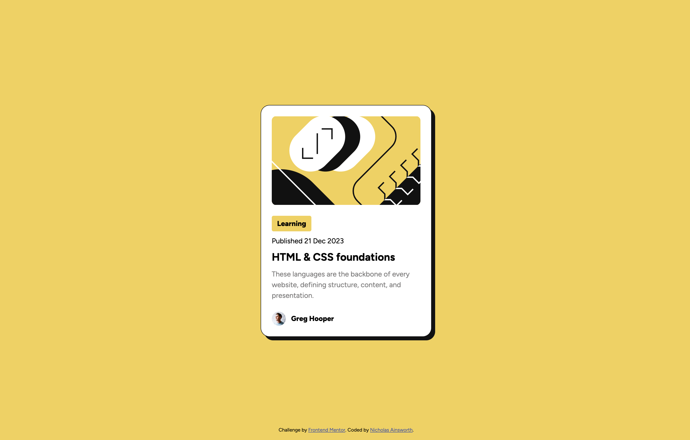

# Frontend Mentor - Blog preview card solution

This is a solution to the [Blog preview card challenge on Frontend Mentor](https://www.frontendmentor.io/challenges/blog-preview-card-ckPaj01IcS). Frontend Mentor challenges help you improve your coding skills by building realistic projects.

## Table of contents

- [Overview](#overview)
  - [The challenge](#the-challenge)
  - [Screenshot](#screenshot)
  - [Links](#links)
- [My process](#my-process)
  - [Built with](#built-with)
  - [What I learned](#what-i-learned)
  - [Useful resources](#useful-resources)
- [Author](#author)

## Overview

### The challenge

Users should be able to:

- See hover and focus states for all interactive elements on the page

### Screenshot



### Links

- Solution URL: [https://www.frontendmentor.io/solutions/blog-preview-card-TW000F1Q-h](https://www.frontendmentor.io/solutions/blog-preview-card-TW000F1Q-h)
- Live Site URL: [https://nainsworth.github.io/blog-preview-card/](https://nainsworth.github.io/blog-preview-card/)

## My process

### Built with

- Semantic HTML5 markup
- CSS custom properties
- Flexbox
- CSS Grid
- Mobile-first workflow

### What I learned

Learned something new using clamp for fluid typography.

To see how you can add code snippets, see below:

```css
:root {
  --font-size: clamp(10px, 4vw, 16px);
}
```

### Useful resources

- [Example resource 1](https://www.example.com) - This helped me for XYZ reason. I really liked this pattern and will use it going forward.
- [Example resource 2](https://www.example.com) - This is an amazing article which helped me finally understand XYZ. I'd recommend it to anyone still learning this concept.

## Author

- GitHub - [nainsworth](https://github.com/nainsworth)
- Frontend Mentor - [@nainsworth](https://www.frontendmentor.io/profile/nainsworth)
<!-- - LinkedIn - [@yourusername](https://www.twitter.com/yourusername) -->
